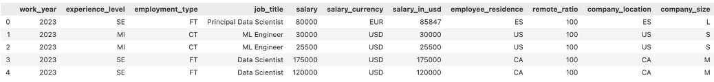
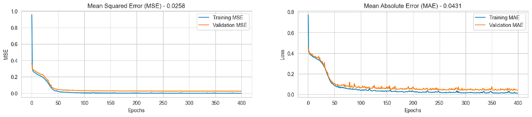

# Leveraging Deep Learning Models for Salary Prediction

## Description

In this study, we explore the application of deep learning models for predicting salaries based on various job-related features. We investigate the performance of different deep learning architectures, including linear regression, Multilayer Perceptron (MLP), MLP with adjusted weights, and Convolutional Neural Network (CNN), on a dataset containing information about job titles, experience levels, employment types, and other relevant attributes. Through extensive experiments and evaluations, we aim to identify the most effective model for salary prediction tasks. Leveraging a dataset comprising diverse job, the models are trained and evaluated to ascertain their predictive capabilities.

## Project Structure

The main notebook containing the final results and related analysis can be found in the `Main_Notebook.ipynb` file, and our previous models demonstrating our learning process are located within the `Previous_Attempts.ipynb` file.

## Dataset

The dataset used in this study is sourced from a reputable job portal and contains information about job titles, experience levels, employment types, and other relevant attributes. The dataset is preprocessed and cleaned to ensure the quality and consistency of the data.

## Methodology

### Data Preprocessing

Before training the deep learning models, the dataset undergoes several preprocessing steps. These steps include handling missing values, encoding categorical variables, and scaling numerical features. The processed dataset is then split into training and testing sets.

### Model Training and Evaluation

The deep learning models mentioned earlier are trained on the processed dataset. The training process involves optimizing the model's parameters using gradient descent and backpropagation. The models are evaluated using various performance metrics such as mean squared error (MSE) and mean absolute error (MAE).

### Results and Discussion

The performance of each deep learning model is compared, and insights are drawn regarding their effectiveness in predicting salaries based on the given job-related features.

## Conclusion

In conclusion, our study highlights the potential of deep learning models, particularly CNNs, in salary prediction tasks. The experiments demonstrate that CNNs can effectively leverage the spatial information embedded in the input data, leading to improved performance compared to traditional MLP models. While each attempt provided valuable insights into the intricacies of the task, including the importance of feature engineering and regularization techniques, none fully addressed the challenges like the CNN model.

